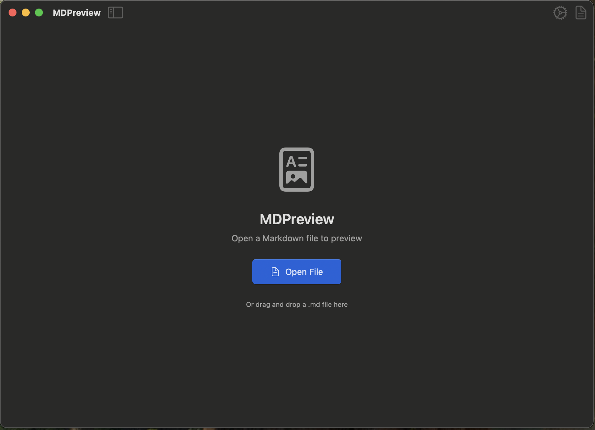
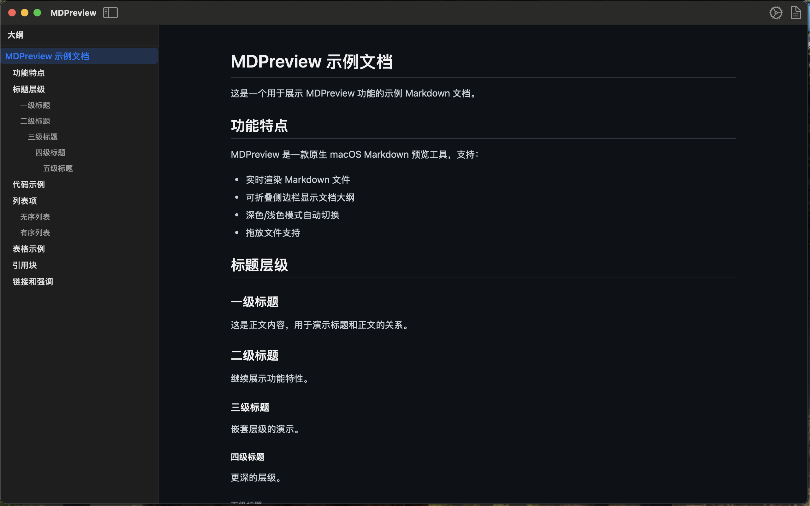

# MDPreview

一款支持折叠侧边栏目录的原生 macOS Markdown 文件预览工具。

## 功能特点

- **Markdown 预览**：打开并实时渲染 `.md` 和 `.markdown` 文件
- **文档大纲**：可折叠侧边栏显示文档标题目录（H1-H6）
- **深色/浅色模式**：跟随系统自动切换
- **拖放支持**：直接将 Markdown 文件拖入应用
- **菜单栏应用**：可选的状态栏图标便于快速访问
- **开机自启**：支持设置登录时自动启动

## 截图




## 安装

### 下载预构建版本

从 [GitHub Releases](https://github.com/aexachao/MDPreview/releases) 页面下载最新版本。

> **注意**：如果打开 DMG 时提示"MDPreview.app 已损坏，无法打开"，这是 macOS Gatekeeper 安全机制导致的。可通过以下方式解决：
>
> 1. **方法一**：在 MDPreview.app 上**右键**（或 Control+点击），选择"打开"，然后在弹窗中点击"打开"
> 2. **方法二**：前往**系统设置** > **隐私与安全性**，向下滚动找到"仍要打开"选项
>
> 此提示是因为应用使用了 ad-hoc 签名（无付费 Apple Developer 证书），应用本身是安全的。

### 源码构建

```bash
# 克隆仓库
git clone https://github.com/aexachao/MDPreview.git
cd MDPreview

# 生成 Xcode 项目
xcodegen generate

# 在 Xcode 中打开并运行
open MDPreview.xcodeproj
```

## 系统要求

- macOS 13.0 (Ventura) 或更高版本
- Xcode 15.0 或更高版本

## 项目架构

MDPreview 采用 **混合 AppKit/SwiftUI** 架构：

- **AppKit**：应用生命周期、窗口管理、菜单栏、状态栏
- **SwiftUI**：用户界面组件
- **WKWebView**：通过 `marked.js` 渲染 Markdown

### 项目结构

```
Sources/
├── main.swift              # 应用入口
├── AppDelegate.swift        # 应用生命周期、菜单栏
├── Controllers/
│   ├── MainWindowController.swift
│   └── StatusBarController.swift
├── Models/
│   ├── DocumentManager.swift
│   └── SettingsManager.swift
├── Views/
│   ├── ContentView.swift
│   ├── EmptyStateView.swift
│   ├── MarkdownWebView.swift
│   ├── SettingsView.swift
│   └── TitleBarView.swift
└── Renderer/
    └── MarkdownRenderer.swift
Resources/
├── marked.min.js           # Markdown 解析库
└── heading-renderer.js      # 自定义标题锚点渲染
```

## 开发

### 持续集成

GitHub Actions 自动执行：
- 每次 push 到 `main` 分支时构建 DMG
- 创建 Git Tag 时自动生成 Release 产物

## 许可证

**GNU Affero General Public License v3.0 only**

- **项目名称**：MDPreview
- **版权**：Copyright (C) 2025 Chris Li

详细内容见 [LICENSE](LICENSE)。

## 贡献

欢迎提交 Pull Request！
